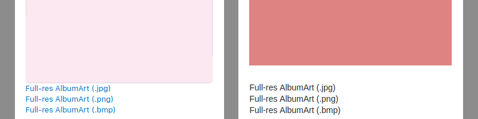

# AlbumArtTool

*A chrome extension to help getting full-resolution album art easily from iTunes or kkbox.*

### Usage

* Click links below album art to download.

  (iTunes on the left, kkbox on the right.)

### Installation

1. Clone this repository, or download as zip and extract.
1. In Chrome, Go to `More tools` > `Extensions`, enable `Developer mode`.
2. Click on `Load unpacked`, select the folder of this extension.

